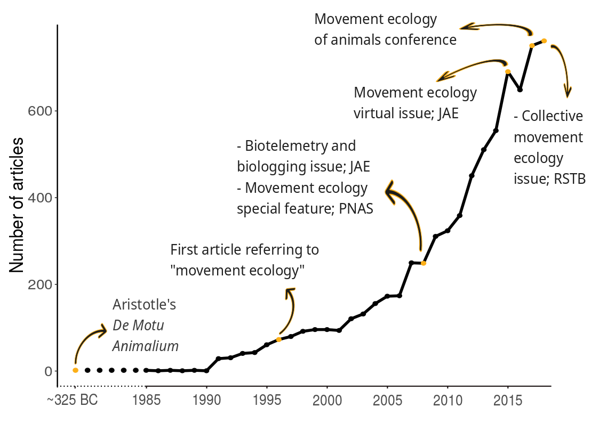

## Abstract (250 words - I'm at 300 now)

Movement is life. It affects population dynamics, biodiversity, and consequently, the structure of ecosystems. With the recent development of sophisticated tracking technology, software and analyses, research in movement ecology has significantly increased in the last decade. This work provides a synthetic and quantitative review of the scientific literature in movement ecology, since the seminal work of @Nathan2008, which formally introduced the movement ecology framework. We searched the Web of Science to select publications in the field of movement ecology by applying a hierarchy of keyword-based filters; the resulting database consisted of 5354 peer-reviewed papers. With a text mining approach, we assessed the number of papers which have attempted to investigate core components of the movement ecology framework—that is, motion, navigation, internal state and external factors—as well as the biologging devices used, the focal taxon, the analytical methods applied and the software used. The changes in the devices and software used reflect an increasing access to finer spatio-temporal data about movement, with increasing ability to process them. However, this is not reflected in the choice of statistical methods which are mostly general rather than movement related. Even more importantly, and just like ten years ago, studies rarely focus on the components of the movement ecology framework (except for external factors). Instead, the topics addressed in the literature were rather organized around other questions, such as fish migration and dispersal, quantitative assessment of collective movement and modeling animal trajectories, as the most popular ones. In 
Based on these findings, we discuss how data and technology could be driving our science, and where we should direct our efforts to. 

Nathan, R., Getz, W. M., Revilla, E., Holyoak, M., Kadmon, R., Saltz, D., & Smouse, P. E. (2008). A movement ecology framework for unifying organismal movement research. PNAS, 105(49), 19052–19059.

[//]: # (RJ: I know that the last line is not saying much. Hopefully we will discuss, multidisciplinarity and its complications, and trying to focus more on the questions - and which questions.)

## Keywords (min 3)

movement ecology, text mining, biologging, human movement, ...

## The rise of a field called movement ecology (there shouldn't be a title for the Introduction)

Movement is intrinsically linked to life and has been a research subject since ancient times. 
Technological developments in the recent decades have opened possibilities to observe and collect data on animal and human movement, and to expand our knowledge on their movement and behavior (Thums et al. 2018, Borger 2016, Williams et al. 2019).
In what is considered a seminal work in the field, Nathan et al. (2008) proposed a unifying conceptual framework for movement ecology, composed of four components: external factors (the set of environment factors that affect movement), internal state (i.e. the inner state affecting motivation and readiness to move), navigation capacity (i.e. the set of traits enabling the individual to orient) and motion capacity (i.e. the set of traits enabling the individual to execute movement). The outcome of the interactions between these four components would be the observed movement path (plus observation errors). 

A concurrent study examined movement-related papers (Holyoak et al. 2008), finding that very few works in the literature addressed the links between these components, with the only exception of external factors with motion capacity (62%). They found that the majority of studies were "simply measuring movement, documenting its ocurrence, or describing how it was influenced by the environment".

Ten years after PNAS' special feature on Movement ecology, where Nathan's and Holyoak's work were published, the number of studies in the field has increased exponentially (Fig. 1), several special issues related to the field have appeared in different journals, and there is now even a Gordon Research Conference on Movement ecology of animals organized every two years (since 2017).
It is a good time [RJ: I'm looking for a synonym to the word kairos in Greek... any ideas?] to reflect on the status of research on this field, where we seem to be going and what challenges await us. 

{width=70%}

Here, we review the field of movement ecology with a quantitative approach. With a hierarchy of keyword-based filters, we searched the Web of Science for movement ecology papers published in 2009-2018, and analyzed the text in the manuscripts to assess which aspects of movement ecology were being studied and the tools that were being used. All the technical details of the text analysis can be found in Supplementary Materials and the code in R is in [RJ: Zenodo repository].

The document is organized as follows. First, we analyze the framework and quantified the study of its different components. Then, we assess the use of different tools (i.e. biologging devices, software and statistical methods) in the papers. Next, we identify research subjects in which papers were organized. Finally, with all these elements in hand, we provide an integrative view of the field, its strengths, limitations and future directions. 

## The movement ecology framework

Most works have addressed the relationship between external factors and movement (77%), and a minority of them have studied the three other components (49%, 26% and 9%, for internal factors, motion and navigation capacity, respectively). The same pattern occurred in the decade before (see Supp. Mat), reflecting that, in the last ten years, movement ecologists have not increased their efforts to understand the processes behind movement. The focus on external factors, and particularly on the environment (Table 1) 

**MB: Despite repeated calls to figure out the mechanics of movement, we're essentially still doing descriptive studies, relating space use to the environment. I would think that one essential reason for this is management and conservation. We work with habitats, areas—in fact, not species. So the most important piece for management/conservation is the link to the physical environment, which is really what we're managing/protecting (probably for good and bad reasons). *Fundamental movement ecology* remains a niche.**

* Problems and interests

Not much change in the studies in framework components respect to the decade before (Fig. 3 and 4). Still a lot more focus on external factors than the others. There should be some discussion about why this is happening. - I think some input from Tommy, Susana, Mathieu would be great for this part (and everybody else who’d like to lend a hand). Also, what can we say about the subcategories of the framework? What do you find interesting? (Tables 1-5) The link to the subcategories and their keywords is: \url{https://docs.google.com/document/d/1F43--6wK_k54kwCyJezpZyiDI2rMnBAqEVmFz7kU0G0/edit?usp=sharing}

{width=70%}

{width=70%}

**MB: In these two figures, all four arrows coming from or going to "Movement path" show widely different numbers than what was presented earlier (e.g. in one the first idea draft). What happened?**

**MB: Also, I'm still not able to read the direction of arrows… and why is there only one number for the two arrows connecting External factors to Internal state?**

[comment 1]: <> (This is a table syntax, you can see it the pdf)

|External factor    |Percentage | Internal factor    |Percentage |Motion capacity   |Percentage | Navigation capacity|Percentage |
|-------------------|-----------| -------------------|-----------|------------------|-----------| -------------------|-----------|
|Environment        |     80.7% | Adaptation         |     45.9% |Empirical         |     50.9% | Orientation        |     73.6% |
|Animal interaction |     38.1% | Life-history       |     42.2% |Biophysical       |     36.3% | Cognitive          |     25.5% |
|Anthropogenic      |     13.6% | Physiological state|     34.5% |Theoretical       |     32.1% | Sensory            |      7.6% |
|Other              |     3.3%  | Behavior           |     7.2%  |                  |           |                    |           |
|General            |     0.4%  | General            |     1.6%  |                  |           |                    |           |

Navigation process     Percentage 
------------------  ----------  
Orientation            73.6%   
Cognitive              25.5%  
Sensory                7.6%  
------------------  ----------

\begin{table}[ht]
\centering
\small
\begin{tabular}{lr}
\hline
\hline
Motion process & Perc. \\ 
\hline
%						\rule{0pt}{11pt}
\noalign{\vskip 0.1cm}    
Biophysical & $34.5\%$ \\ 
Empirical & $26.7\%$ \\ 
Theoretical & $20.7\%$ \\
\hline
\hline
\end{tabular}
\caption{Percentage of motion papers related to each category. *Biophysical: biomechanic, locomotion;	*Empirical: soaring, dive; 			*Theoretical: random walk, sinuosity;}
\end{table}				

[comment 5]: <> (This is a table syntax, you can see it the pdf)

\begin{table}[ht]
\centering
\small
\begin{tabular}{lr}
\hline
\hline
Navigation process & Perc. \\ 
\hline
%						\rule{0pt}{11pt}
\noalign{\vskip 0.1cm}    
Cognitive & $21.4\%$ \\ 
Orientation & $14.5\%$ \\ 
Sensory & $5.0\%$ \\
\hline
\hline
\end{tabular}
\caption{Percentage of navigation papers related to each category. *Cognitive: memory, cognition;		*Orientation: compass, homing, path integration; *Sensory: olfact, chemor, magnetor;}
\end{table}			

## Acknowledgements [So I don't forget to thank people]

* Trey Shelton, from UF library, for helping with APIs and TDM rights.
* Luis Cajachahua Espinoza, for help with scrapping possibilities at the first stages of exploratory analysis. 
* Everyone who participated in the survey. I haven't mentioned the survey in the paper, btw.

## Authors' contributions [I will be adding stuff but feel free to add or edit]

* RJ conceived the ideas of the review and designed the study
* RJ and SP worked on the search keywords for mov-eco papers
* RJ, SP and MEB worked on codes to clean the results from WoS
* RJ and SP downloaded the papers and dealt with TDM rights
* RJ wrote the codes to extract material and method sections
* RJ, TAC, MEB, SP and MB lead the dictionaries and checked their precision (quality control)
* SCT and TAC worked on the subcategories of the framework dictionary
* RJ, MEB and MB wrote the codes to analyze the papers with the dictionaries
* SP and MEB implemented the codes for identification of species and classification in taxonomical groups
* RJ and VR implemented the LDA modeling approach
* RJ and MEB produced the figures for the manuscript
* RJ, SP, TAC, MEB and MB worked on the questions of the survey and MEB implemented it in an online platform
* RJ analyzed the results of the survey
* RJ and MB worked on the outline of the manuscript
* RJ, SP, MB, TAC, MB and SCP actively participated in discussions about the outcomes of this work

* Everybody wrote something?
* There will be something to say about a Zenodo repository
* MEB gave coding support in different stages 

In 2008, 
PNAS published a special feature on Movement ecology, 
Movement ecology is a research field gathering studies of all types of movement involving all organisms (Nathan 2008). 

We searched the Web of Science to select publications in the field of movement ecology by applying a hierarchy of keyword-based filters; the resulting database consisted of 5354 peer-reviewed papers. With a text mining approach, we assessed the number of papers which have attempted to investigate core components of the movement ecology framework—that is, motion, navigation, internal state and external factors—as well as the biologging devices used, the focal taxon, the analytical methods applied and the software used. 
___

MB: Best reviews have a message. We need a message. I guess one angle for the review could be to focus on one striking result: the devices and the software used have changed quite a bit, but the questions we're asking (the framework) did not. In other words, we have access to ever finer spatio-temporal data about movement, and increasingly sophisticated software, but we're addressing the same questions. The inner loop of the framework (the three processes: navigation/motion/propagation) is somewhat neglected, and actually is still as much neglected as 10 years ago. Now the real question is: Is this (or is it going to be) a missed opportunity, or is the nature of ecology that we are not prioritizing processes, but the outer loop give us enough answers to actually tackle real-life problems? Let's discuss that and see if we agree on something here—I don't know that there is a simple answer to that.

Let me suggest that we organize the manuscript in four main section (but of widely varying sizes):

* When? The story of Movement Ecology (→ that would work as an introduction)

* What? Questions of Movement Ecology (→ the framework)

* How? Material and methods in Movement Ecology (→ tools, devices, methods, etc.)

* Topics of Movement Ecology, or a multidimensional perspective on Movement Ecology (→ word clouds + Sankey diagram)

The content is here for every section already, but that would allow for a better integration at the end: during these ten years, we've seen deep changes in data/tools/etc. (the How), but not at all in the very questions we're addressing (the What). Topics are largely orthogonal to this, and actually allow to discuss further…

___

*  It's still a methodological paper on movement ecology, about where we are and where we are going (or should go)

## Intro

An Intro on Nathan's paper, grow in the field due to technological advances for tagging, software for processing and analyzing data and methods. We can prepare a time line like in the poster with the number of publications + special features (Fig. 1). 

**MB: I would actually remove 2018 from the plot… it is very misleading (and mention it in the caption if needs be).**

We could mention conferences related to movement ecology, biologging and statistical ecology. And then, introduction to a need to stop and see what we are doing, where are we going and with what tools.

"){width=70%}

Two short paragraphs about methods: One about identifying the mov-eco papers. I don't like to spend much on this part but I guess that's important. Saying that with the combinations of words we use (we could only show them in the supp. mat.) we make sure that > 80% papers are mov-eco papers, but we may lose some others not included here. Could there be biases? 

**MB: I don't think we can expect systemic biases… and that may be the key here: Limitations, but likely not biased.**

We should certainly address this in one or two lines, but Idk how to tackle this exactly (i.e. finding out a type of paper we could be missing because of our word criterion). A second short paragraph about the actual analysis: examining title + keywords + abstract + materials and methods, asking about specific stuff (i.e. framework, software, devices, methods) with dictionaries and topic identification with LDA models. The idea would be to mention all this - along with the fact that we perform quality control at every stage of the analysis - but only detail these parts in Supp. Mat. 

**MB: I agree, here the most important thing is that people understand what we did, not how we did it—details are irrelevant (go check the appendices!).**

In Supp. Mat, there will also be a list of caveats with our analyses; e.g. the fact that we can find a paper on birds and mammals with GLS data and our algorithms will not conclude that GLS were only used on birds (not mammals).

**MB: I don't understand your example…**

## Main results:

### Overall trends:

Increasing trends in the number of publications (Fig.1) and number of species studied (Fig.2), consistent with everything in the intro and the fact that there are more publications in science in general. Can someone get a reliable time series (or data to produce that curve) of the number of publications in science or in ecology? Or a publication showing it? 

**MB: I found this: http://blogs.nature.com/news/2014/05/global-scientific-output-doubles-every-nine-years.html showing 8-9% growth rate in the 20th century… Not sure how much this is comparable, especially since late stages (decrease since the 80s) may be purely methodological.**

{width=70%}

**MB: This figure is actually very interesting, as there is only a limited number of species—one could argue that the global species list also increases fast… Intuitively, I would conclude that there are more and more species amenable to the use of tracking tags (because of new technologies and miniaturization). Also probably OK to combine this figure with Fig.1.**

### Framework:

### A shift in the use of tagging devices

Increase use of video and accelerometer data in publications (Fig. 5), meaning that people are actually trying to measure movement explicitly, and not just by sampling locations in time (if the idea is not well expressed please help me). 

**MB: To me, this is related to the search for a mechanistic approach—thanks to technology, we have access to data at an ever finer spatiotemporal resolution, which should be able to disentangle better what we actually observe. The main benefit from acc. vs. GPS is really the temporal resolution; from VHF to GPS was finer spatio-temporal resolution; same for videos. However, the fact that studies related to processes (navigation/motion/propogation) are still rather low and did not vary much implies that we're not changing our focus despite dramatically finer data…**

This means that there are things that could be explored more deeply, like motion with accelerometer, or use of cues to navigate or change before with video. It also presents new challenges in terms of data processing and analysis. 

Tommy's comment: I think the right terms are egocentric and exocentric. I.e. studies increasingly have an egocentric frame of reference (i.e. movement of animal) rather than just their x and y positions in the environment. See this paper which might be relevant here - https://besjournals.onlinelibrary.wiley.com/doi/pdf/10.1111/1365-2656.13094

**MB: Not really (or point me to references that use ego/exocentric in this manner). They both refer to navigation processes, and indeed the frame of reference. Egocentric is kind of "I turn to my right now", while exocentric is "Make a turn East when reaching this tree". In any case, I don't think this would apply here (or ego would include accelerometers, and exo video, although onboard camera, like on reindeer would be ego). See Fagan et al. 2013 Eco Letters.**

{width=70%}

### Towards an R community

Software-wise, there is a homogenization process towards R (Fig. 6). The second most used software, ArcGIS, is steadily decreasing in use. It may be a sign that research is going from space occupancy or use, to studying actual movement. R doesn’t only have a lot of packages to process and analyze movement (I’d mention the R-pkgs review), but it also offers a free software environment to program and create new methods. If the whole community is converging towards one software, there is potentially a lot that we can do together to rapidly improve processing and analysis. - I’m sure Mathieu could expand on this.

**MB: We could indeed slightly expend on the monopolistic situation of R (which is not gonna change soon if we extrapolate the curve forwards). Any monopolistic situation is by essence bad, but actually R this is largely compensated by the fact that R is not monolithic, and mostly give access to a core engine from which we build packages—the diversity of software has been transferred at the R package level. Secondly, and possibly equally important, R also leverages all languages by allowing access to other languages internally (e.g. C, python, Fortran, etc.). In general, in terms of ideas, fragmentation is good—there is a lack of foundational standards though to organize the "bazaar" (as coined in the open-source world).**

Mathieu's comment during the meeting was about ArcGIS being used mostly for data processing before (so analyses with other software), and now R is enough for that. He was surprised of both the poor use of R at the beginning of the decade and its huge popularity at the end. 

Tommy's comment: Is use QGIS or similar programs increasing - this would tell you that spatial analysis/mapping is fairly constant still. I think you could mention that increasingly there are more sophisticated packages in R for creating maps/figures/data vis.
Rocío: My answer to the QGIS part is that its declared use was very poor.

{width=70%}

### Methods for analysis: are we using movement specific methods?

Concerning methods, most papers are using general methods and not many “movement-specific” ones (e.g. step selection functions, state-space models, individual-based models, random walk models) [Check Table 6 and Fig. 7, and dictionary file in the repository, ./Data/Dictionary/Synonyms-Methods.csv, for methods words]. Most papers use general methods like generalized linear (mixed and not mixed) models, ANOVAs, etc., when analyzing tracking data (mostly to analyze the effect of an environmental covariate, from what I can remember). Or, as Tommy said, there are many descriptive pieces. It is true that sometimes we don’t require the use movement-specific methods, and the aim of the paper is not to judge, but in the context of increased number of publications, movement-specific devices and convergence towards the use of R, we expect that the use of movement-related methods will increase. The proportion of papers per year mentioning movement methods have actually decreased, and I wonder if it’s because the use of these methods has not increased at the same speed as the number of publications. [I could also have forgotten words in the dictionary; that’s possible; but we had an acceptable quality control result. All QC results should go on Supp. Mat.; I only have to find where they are].

**MB: I'm having a hard time interpreting this, but I think we should discuss it—it seems very interesting to me:**

- **It's concerning: We would indeed expect more movement methods, because we're developing specific methods for movement, and that's a good way to make the most of this wealth of incredible data that we have now—basically new challenges (from the data) require new specialized methods.**
- **It's actually a good thing: The field has matured enough, and is used by a broader base, with generic tools.**

**MB: What is relatively surprising though is that we know there is more and more specialized R packages… So what do they do? Maybe it is that new methods are based on general bricks. Take Simona's method/package for instance: it is based on time series analysis, cluster analysis, and survival analysis. Nevertheless, it is a very specialized movement method.**

**MB: So I guess I'd like to go back to what it is that actually defines movement methods… If that's our view from 10 years ago, it's normal that it decreases, as new methods are used everyday…**

[comment 6]: <> (This is a table syntax, you can see it the pdf)

\begin{table}[ht]
\centering
\small
\begin{tabular}{lr}
\hline
\hline
Method & Perc. \\ 
\hline 
\noalign{\vskip 0.1cm}    
general & $62.2\%$ \\ 
Movement &  $20.5\%$ \\
spatial & $7.8\%$ \\
time series &  $7.2\%$ \\
social & $2.3\%$ \\
other & $0.7\%$ \\
spatiotemporal & $0.4\%$ \\ 
\hline
\hline
\end{tabular}
\caption{Percentage of use of each type of statistical method in publications. A publication may be using several types of methods.}
\end{table}

{width=70%}

### Main topics in movement ecology

For all coauthors: Topic analysis was performed using LDA. As I explained in an email, I could have used the standard way to choose topics which is the perplexity score, but that usually ends up with hundreds of topics. I found stuff online about using a coherence metric, but that may require a bit of time exploring. I personally think we could justify our choice of 13 as the minimum number that can provide interpretable topics. 

**MB: Do you mean 'maximum'?

If you want to check if a lower/higher number would give interpretable topics, see word clouds in the repository: /Rocio/plots/ and check all files with a name like wordcloud_topics_X_alpha_1_method_VEM.pdf. You can share with us if you have a different choice. Also, feel free to say if you think we absolutely need some time to use a coherence metric. I read a post online from a guy who is finishing his PhD on that, so he didn't have all results to show. But it is not impossible to do our own research on it. 

So this part would be about describing topics. Check Fig. 8. 

**MB: This part is actually concerning me, as said in my previous email. There are too many topics that don't seem to make sense to me…**

### Putting it all together (not a great title, I know)

The sankey graph below try to summarize the whole story. We show only the taxonomic groups that have the highest number of papers. (There are more graphs in /Matt/plots/Sankey. Feel free to check them and see if a plot I don't show here would be better for the manuscript.) The size of each column is proportional to the number of papers related to that category. For instance, there are way more papers focused on mammals than on the other groups. All animal groups are significantly more related to external factors. Humans, on the other hand, are almost equally focused on the analysis of external factors, the internal state and motion. Navigation is the least studied in all groups. Some framework components are more linked to some topics than others. After analyzing the topics and labeling them, would you say that these links make sense? Is a component (e.g. navigation) been neglected in a topic where it should be important? 

We also discussed the idea of shading some not so important topics. And actually the fact that some topics are seen in few papers should be analyzed. I don't want to go ahead on my ideas because I want you to first give it a try at labeling the topics, but after you do that, I'd love for you to share your thoughts. So please check the graphs per taxon in /Matt/plots/Sankey, add text to the document based on your interpretations (not just descriptions, but ideas of what to show in the paper) and say which graphs would be best.

**MB: Generally speaking, the Sankey diagram reinforces what I thought the topics were, but does not help address my doubts… So I remain pretty much where I stand, which was summed up in my previous email. Sankey diagram and topics are consistent, as far as I'm concerned. Two points in particular:**

- **I'm surprised to not see more "humans" in topic #11, which I associated to human-dominated landscapes… but maybe that's not how it works?**

- **Topic #12: only half of it is associated to birds/fish/mammals/insects/humans… that's not much left, so what is it about?**

## Conclusions

The paper could close on the opportunities in working together, human and animal fields, using more sophisticated tools, in a united software community, and trying to tackle more the neglected components of the framework. We should discuss the challenges to overcome. 

