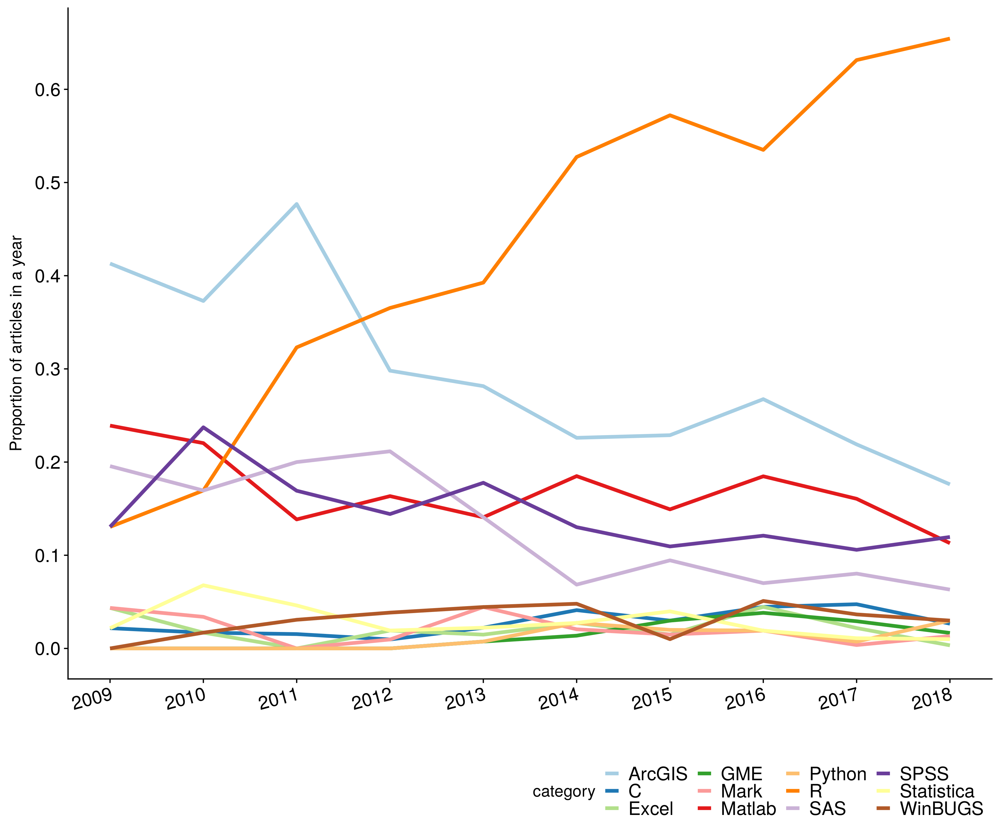

## Abstract (250 words - I'm at 286 now)

Movement **New branch edit**affects population dynamics, biodiversity, and consequently, the structure of ecosystems. With the recent development of sophisticated tracking technology, software, and analyses, research in movement ecology has significantly increased in the last decade. We aimed to provide a synthetic and quantitative review of the scientific literature in movement ecology since the seminal work of Nathan et al. (2008), which formally introduced the movement ecology framework. We reviewed 5354 peer-reviewed papers in movement ecology published in the last decade. Using a text mining approach, we assessed the number of papers that have attempted to investigate core components of the movement ecology framework—that is, motion, navigation, internal state, and external factors—as well as the biologging devices used, the focal taxon, the analytical methods applied, and the software used. The changes in the devices and software used reflect an increasing access to finer spatio-temporal data about movement, with growing ability to process them. However, this is not reflected in the choice of statistical methods which are mostly general rather than movement-related. Even more importantly, and just like ten years ago, studies rarely explicitly focus on the components of the movement ecology framework (except for external factors). The research topics identified in the literature were organized around questions that corresponded to a mix between understanding theoretical movement processes, data collection and analysis, and practical applications. [SP: This sentence is unclear to me. I'm not sure what you meant] Based on these findings, we discuss how data and technology have been driving our science, research questions that have not been given enough consideration, and the necessary trade-off between theory and technology. 

Nathan, R., Getz, W. M., Revilla, E., Holyoak, M., Kadmon, R., Saltz, D., & Smouse, P. E. (2008). A movement ecology framework for unifying organismal movement research. PNAS, 105(49), 19052–19059.

## Keywords (min 3)

movement ecology, technology, text mining, biologging, human movement, ...

## The rise of a field called movement ecology (there shouldn't be a title for the Introduction but I like this one)

Movement is intrinsically linked to life and has been a research subject since ancient times. [SP: How about citing the Aristotle De Motu Animalium that is in the timeline figure here?] 
Technological developments in the recent decades have opened possibilities to observe and collect data on animal and human movement, and to expand our knowledge on their distribution and behavior (@Thums2018, @Borger2016, @Williams2019).
In what is considered a seminal work in the field, @Nathan2008 proposed a unifying conceptual framework for movement ecology, consisting of four components: external factors (i.e. the set of environmental factors that affect movement), internal state (i.e. the inner state affecting motivation and readiness to move), navigation capacity (i.e. the set of traits enabling the individual to orient), and motion capacity (i.e. the set of traits enabling the individual to execute movement). The outcome of the interactions between these four components would be the observed movement path (plus observation errors). 

A concurrent study examined movement-related papers (@Holyoak2008), finding that very few works in the literature addressed the links between these components, with the only exception of external factors with motion capacity (62%). They found that the majority of studies were "simply measuring movement, documenting its ocurrence, or describing how it was influenced by the environment".

Ten years after PNAS' special feature on Movement ecology -- where Nathan's and Holyoak's work were published -- the number of studies in the field has increased exponentially (Fig. 1), several special issues related to the field have appeared in different journals, and there is now even a Gordon Research Conference on Movement ecology of animals organized every two years (since 2017). It is a good time [RJ: I'm looking for a synonym to the word kairos in Greek... any ideas?] [SP: How about "the time is ripe"?] to reflect on the status of research on this field, and to investigate the role of ideas (e.g. the movement ecology framework or MEF), data, and technology in the field, and what challenges await us. 

     [Comment MEB]: # (MEB: Just suggestions idk if they fit or not: pivotal, momentous, apropos, crucial, convenient, pertinent, oppurtune...actually felicitous might work to mean just that)

{Fig.1. Timeline of movement ecology papers and milestones in the field}

For this purpose, we reviewed the field of movement ecology using a quantitative approach. With a hierarchy of keyword-based filters, we searched the Web of Science for movement ecology papers published in 2009-2018, and analyzed the text in the manuscripts to assess which aspects of movement ecology were being studied and the tools that were being used. All the technical details of the text analysis can be found in Supplementary Materials and the R code in [RJ: Zenodo repository].

The document is organized as follows. First, we analyzed the MEF and quantified the study of its different components in the literature within the past decade. Then, we assessed the use of different tools (i.e. biologging devices, software, and statistical methods) in the papers. Next, we identified topics and research subjects that papers addressed. Finally, with all these elements in hand, we provided an integrative view of the field, its strengths, limitations, and future directions. 

## The movement ecology framework

Most movement ecology studies in the past decade have addressed the relationship between external factors and movement (77%), and a minority of them have studied the three other components of the MEF (49%, 26% and 9%, for internal factors, motion and navigation capacity, respectively). [SP: I wouldn't call 49% a minority...] The same pattern occurred in the decade before (see Supp. Mat), reflecting that, in the last ten years, movement ecologists have not increased their efforts to understand the processes behind movement. The focus on external factors, and particularly on the environment (Table 1), might be a result of having management and conservation as an ultimate goal from understanding movement (@Allen2016; @Ogburn2017). 

    [Comment 2]: # (RJ: Tommy asked for time series. They are in the Supp. Section. There is not much change in time. I am also putting the framework figures (from each decade) in Supp. but we can take them out if there if you think that they are key in the manuscript.)
    
    [Comment 3]: # (RJ: Mathieu made interesting comments, that I copy here. I prefer if he edits directly in the text, or someone else. "MB: Despite repeated calls to figure out the mechanics of movement, we're essentially still doing descriptive studies, relating space use to the environment. I would think that one essential reason for this is management and conservation. We work with habitats, areas—in fact, not species. So the most important piece for management/conservation is the link to the physical environment, which is really what we're managing/protecting (probably for good and bad reasons). *Fundamental movement ecology* remains a niche.")
    
    [Comment MEB]: #(MEB: I was having similiar ideas on the drivers here. And in my gut I want to say that this is tied back to what is funded, but I can't find any resources to prove the point that one type of research is funded over the other. These internal questions just dont seem to have strong ties back to the physical world/conservation so it makes sense theyre not studied in depth.)

    [Comment 8]: # (SP: I like what Mathieu said above, and I would even take it one step further: the very etymology of the word "ecology" comes from "oikos" and "logos", which is "the study of the home" which in other words means the study of the environment. The definition of ecology by Ernst Haeckel (1866) is "All the comprehensive science of the relationship of the organism to the environment". So ecology is inherently focused on the environment. Dealing with the internal state of an animal is closer to ethology than it is to ecology. Motion capacity is closer to biomechanics. Navigation is closer to neuroscience. But ecology is inherently environmental. To me it's pretty natural that ecologists spend all their time thinking about the effect of external factors on animals.")

It is not only more practical but also easier to observe and collect data from external factors like the environment, other individuals or humans. There are satellite data on environmental features, and animal interaction -- in some cases -- could be observable, and human pressure could be accounted for if there are data from before and after some kind of impact (e.g. noise or urbanization). Conversely, physiological, behavioral syndrome, biophysical, and orientation aspects, among others, may need additional data on body conditions or controlled environments to make tests. [SP: But we have a lot of this from biologging devices such as heart-rate monitors, accelerometers, vital rates sensors, etc... There was a whole special feature of JAnE on combined sensors for biologging last year.] Out of the four components of the MEF, navigation was the least studied. Understanding how animals orient in space, using cues and memory may be one of the most challenging tasks in movement ecology. Although advances have been made (e.g. regarding the use of magnetic and sun compass, or the use of odour by many animal species; @Hansson2014), many challenges remain, like understanding how the information is processed by the brain, or obtaining olfactory or sound landscapes data to test hypotheses in the field.  

Studying any of these components and thus understanding the movement process of organisms require integrative and multidisciplinary efforts involving ecologists, biologists, neuroscientists, physicists and statisticians, to cite some examples. [SP: Yes! I like this point. Goes well with what said above that some of the MEF components are not strictly the job of ecologists...] Because of satellite data availability, a practical need for multidisciplinarity could be lower for external factors. [SP: Not only because of satellite data availability, but also because studying the effect of external factors on organisms is essentially what ecology is] All of these reasons (interest for conservation, data availability, less need for multidisciplinary work) could explain that the majority of movement ecology studies are related to external factors. This pattern was seen in all animal taxonomical groups, except in humans, for which the studies were more uniformly distributed between external factors, internal state and motion (see Fig. 2). For humans, studies would not respond to practical conservation purposes but rather to health and movement efficiency, which involve internal aspects (e.g. nutrition, heart rate, respiration) and motion (e.g. locomotion and biomechanics). [SP: Which reinforces the point above: these studies are not in ecology] The necessary data is also easier to obtain from humans, since they could be directly interested in improving their health (e.g. patients) and increase their movement power (e.g. sport players).

    [Comment 4]: # (RJ: If you disagree with what I wrote or find it confusing, please let me know. And feel free to modify the text and complement it with your ideas. )

|External factor    |Percentage | Internal factor    |Percentage |Motion capacity   |Percentage | Navigation capacity|Percentage |
|-------------------|-----------| -------------------|-----------|------------------|-----------| -------------------|-----------|
|Environment        |     80.7% | Adaptation         |     45.9% |Empirical         |     50.9% | Orientation        |     73.6% |
|Animal interaction |     38.1% | Life-history       |     42.2% |Biophysical       |     36.3% | Cognitive          |     25.5% |
|Anthropogenic      |     13.6% | Physiological state|     34.5% |Theoretical       |     32.1% | Sensory            |      7.6% |
|Other              |     3.3%  | Behavior           |     7.2%  |                  |           |                    |           |
|General            |     0.4%  | General            |     1.6%  |                  |           |                    |           |

Table 1. Categories in which each component of the movement ecology framework is split. The percentages are computed as the number of abstracts referring to the category divided by the number of abstracts concerning the correspondent component, multiplied by 100. 

    [Comment 5]: # (RJ: Tommy, can you improve the caption of Table 1 explaining the elements that need explanation? Or simply point at the link to the readme. Whatever you think it's best, if you think we should keep this table here.)
    [Comment MEB]: # (MEB: I can not read this table well at all. Partially it can be displayed better (colors or physical dividers between categories/columns), also better explained in the caption (as mentioned). For instance I cant figure out whats supposed to add up to 100%, what isnt, and why any of that is)
{Fig.2. Sankey plot showing the distribution on papers concerning the different taxonomical groups, framework components and main topics. Line segment thickness is the relative number of papers sharing two categorical nodes (e.g. About 50% of mammal papers are about external factors, where as only 30% of external papers were about mammals). *Humans are considered as a separate group for interpretation.}

    [Comment 6]: # (RJ: Matt, can you add a very short explanation of how to read the Sankey plot in the caption?)

## Tools for movement ecology
(
(original){
Technology has been a major driver in movement ecology. Literature reviews highlight a growing trend in the amount and variety of tracking devices, which are becoming more afordable, with more-efficient parametrization for battery saving and shrinking in size (@Thums2018, @Kays2015, @Harcourt2019). Here we categorized tracking device observations as accelerometer, acoustic telemetry (referred to as "acoustic"), body condition measurements ("body conditions"), encounter observations ("encounter"), GPS (handheld devices and tagged devices), light loggers, pressure data, radar, radio telemetry, satellite and video/image ("video"). Details of these categories and the analysis are in Supp. Mat. Throughout this last decade, GPS has not only remained the most popular device in movement studies, but its use has increased (in proportion to the total number of studies, see Fig. 3). This is likely due to the development of smaller and more efficient devices, which make them a good option for small and medium size animals (@Kays2015), particularly mammals and birds (see Fig. S10 and S11 in Supp.Mat.). GPS could also be replacing radio telemetry (@Allan2018), which has been experiencing a decreasing trend. On the other hand, the use of accelerometers and video is becoming more popular in the field, allowing for finer spatio-temporal resolution movement data (Fig. 3). 
}
(simonas){
Technology has been a major driver of discovery in movement ecology. Literature reviews highlight a growing trend in the amount and variety of tracking devices, which are becoming more afordable, with more efficient parametrization for battery saving, and shrinking in size (@Thums2018, @Kays2015, @Harcourt2019). Here ,we categorized tracking device observations as accelerometer, acoustic telemetry (referred to as "acoustic"), body condition measurements ("body conditions"), encounter observations ("encounter"), GPS, light loggers, pressure data, radar, radio telemetry, satellite, and video/image ("video"). Details of these categories and the analysis are in Supp. Mat. Throughout this last decade, GPS has not only remained the most popular device in movement studies, but its use has increased (in proportion to the total number of studies, see Fig. 3). This is likely due to the development of smaller and more efficient devices, which make them a feasible option for small and medium-sized animals (@Kays2015), particularly mammals and birds (see Fig. S10 and S11 in Supp.Mat.). GPS could also be replacing radio telemetry (@Allan2018), which has been experiencing a decreasing trend. On the other hand, the use of accelerometers and video is becoming more popular in the field, allowing for finer spatio-temporal resolution movement data (Fig. 3). [SP: I don't think that the point of accelerometers and video is to increase spatio-temporal resolution, rather they provide different types of data.]
}

    [Comment MEB]: # (MEB: I do have to caution that we have no idea that amount of these papers that used hand held gps devices versus tags. I would not be confident in saying which one is the majority. If this is an issue we might have to seperate them into two new categories and try to search 'hand held GPS' and 'gps & tag'. Thats if we can find the right words to separate the categories well. I'm not sure.)
    [Comment MEB]: # (Also as soon as we figure out what graphs we want I'll need to work on all these line graphs, aesthetically. There should be a better way to show off what we want)
    
{Fig.3. Proportion of papers of each year using each type of device}

    [Comment 9]: # (SP: Is this figure final? I'd suggest fixing the legend with capital letters and replacing the dot in "Body.conditions" and "light.loggers" (e.g., "Body conditions", "Light loggers", "Accelerometers"). Also make them either all singular or all plural. Probably obvious but I thought I'd mention it in case it gets overlooked)

The increasing volume and diversity of movement data obtained through these tracking devices require appropriate software tools for data management, processing, and analysis (@Urbano2010, @Joo2020). We evaluated the use of 36 software (Supp.Mat) and found a marked growing trend in the use of R and a decreasing trend in the use of the other 5 most popular software (i.e. ArcGIS, Matlab, SPSS, and SAS) (Fig. 4). In another study in the field of ecology, [SP: What field specifically?] the same pattern in reported R usage was observed (@Lai2019). According to both studies, the popularity of R ten years ago was very low ($> 10\%$ of the papers used it) and now the majority of articles have reported using it. At least for movement ecology, these findings could be an indication of a homogeneization process towards R. R does not only have more than 50 packages to process and analyze movement (@Joo2020), but it also offers a free software environment to program and create new methods, share them, and improve them, facilitating transparency, collaboration, and reproducibility (@Lowndes2017). R also leverages other programming languages (e.g. C, python, Fortran, etc.) by allowing access to their use internally and in combination with R syntax. While there is a possibility that other free and open software could eventually gain popularity in movement ecology over R, the evidence suggests that it will likely not occur in the foreseeable future (Fig. 4).

{Fig.4. Proportion of papers of each year using each software (12 most mentioned software)}

In parallel with the development and improvement of tracking devices and software, a large literature on quantitative methods for the study of movement has been published, mostly on movement models (e.g. @Patterson2008, @Jonsen2013, @Johnson2008). We investigated the use of statistical methods in the movement ecology literature (see Supp. Mat. for methodological details). Most works (71%) used general statistical methods (i.e. with no explicit spatial or temporal component in its definition such as regression models) and less than a third of them (32%) used movement methods (i.e. methods specifically developed for movement or spatiotemporal methods commonly applied to movement data). Researchers are not necessarily using movement-specific techniques to analyze movement. Actually, when accounting for movement, (non-movement) spatiotemporal, spatial, time series, and social analysis, 57% of the papers used at least one method within these categories of them, which is still less than the use of general methods (71%). [SP: I don't understand what the previous sentence means. The part "when accounting for movement" especially confuses me, but the whole sentence is unclear] Actually, we found that the proportion of papers using any of these other types of methods is decreasing, and more papers are using methods that do not naturally account for time, space, or movement (Fig. 5 and 6). The word cloud built from methods sections (Fig. S12) did not highlight any particular method except for "regression" (26% of the papers), unless we associate some words such as "mix" and "effect" (18% of the papers mention "mixed effect" or "mixed model" in their methods section), or "step" and "selection" (1% of the papers mention "step selection"). Only 4% of the methods sections mentioned "movement model". 

{Fig.5. Proportion of papers of each year using each type of method}

{Fig.6. Proportion of papers of each year using general methods and others}  

    [Comment 10]: # (SP: The legend of this figure is very anonymous... The categories are labeled "general" and "others". I'd suggest using more informative labels (I understand this will be explained in the caption but I think the reader would benefit by being able to know more or less what's going on at a glance))

While the availability of movement data and software tools to handle it is increasing and many methods have been developed to analyze it (see a summary list in @Borger2016), [SP: I noticed sometimes you use "data is" and sometimes "data are", I'd stick to either plural or singular throughout] movement-specific analytical methods have not been adopted by the majority of the community yet. There may be works that do not require movement-specific methods (e.g. descriptive papers); however, as we intensify data collection and processing, the use of movement models -- for a statistical representation of movement and for inference towards the population level -- should increase accordingly. Movement is a complex process, and in most cases, statistically noisy, nonlinear, and spatially and temporally correlated (@Patterson2017). Multidisciplinary work between ecologists and statisticians to "decomplexify" models (either making them more simple or usable for different datasets and situations) remains a challenge. 

    [Comment 7]: # (RJ: Do you think I should say something about machine learning? I could ramble about how people say it's going to be the "thing" now with all the data we are getting, but honestly up to now only 1% of methods sections have said "machine learning", "deep learning" or "big data" -- OK, they could use other words. I don't think it's that relevant now, and I don't think it's a good thing if people just turn into that and forget about movement modeling and trying to get mechanistic approaches to modeling movement. Hence, I've got things to say but I'm not sure that it's worth it for the paper. Thoughts?)
    [Comment 11]: # (SP: I wouldn't bother saying anything about it. We don't even have data from our results to say anything about it, so it would mostly just be taking the opportunity of the paper to plug in an opinion. I'd leave it out)

## Topics and research subjects in movement ecology

We investigated the research subjects addressed in movement ecology papers. We analyzed the paper abstracts using a Latent Dirichlet Allocation (LDA) model (@Blei2003) and identified 15 general topics from the abstracts (see Supp. Mat. for details). We fixed the number of topics to 15, as a reasonable value that would not be too large than we could not interpret them, or too small that the topics would be too general (see discussion in Supp. Mat.). Within the LDA modeling framework, an abstract -- or rather meaningful words from an abstract -- is a mixture of all the latent topics (not known _a_ _priori_), and the degree of association between the abstract and each topic is characterized by a parameter $\gamma$ that varies from 0 to 1. If a topic was not relevant at all for a given abstract, its $\gamma$ would approach zero, and it would approach one in the opposite case (the sum of all $\gamma$s for an abstract is equal to 1). Each topic is defined as a mixture of all words and what distinguishes a topic from another is the relative frequency of each word (i.e. some words could be strongly related to a topic and barely appear in another). This relative frequency is represented in the word clouds of Figure 7, used for the interpretation of the topics: 1) Predator, 2) Wildlife habitat, 3) Social behavior, 4) Physical activity, 5) Data, 6) Models, 7) Fish movement, 8) Sex and dispersal, 9) Home range, 10) Marine foraging behavior, 11) Human motion, 12) Animal motion, 13) Tests, 14) Marine habitat and 15) Breeding and migration. 

    [Comment 12:] # (SP: This paragraph above is way heavier in methods than any of the others, where the description of the methods is left for Supp.Mat. This is probably because explaining a bit of the methods is necessary here to even be able to describe the results, but maybe I'd think some more about how to leave the methods out of the main text as much as possible (and especially to be consistent in how much is explained in the text for the different aspects of the analysis).)

The three most addressed topics in the abstract (i.e. higher sum of $\gamma$s) were models, data, and social behavior. Since it is common practice to mention data and methods in abstracts, it is not surprising that both of them are recurrent topics. Furthermore, the models topic does not strictly refer to movement models; it encompasses any type of model (e.g. generalized linear model, model selection criterion or even schematical model) that could be used to study dynamics, patterns, and populations (Fig. 7). A third place for social behavior is rather unexpected, but could be partly explained by the general interest in utilizing individual movement for understanding dynamics at the scale of populations. 

    [Comment 7+1]: # (RJ: Other ideas?)

    [Comment MEB]: # (MEB: I wonder if we can be a little more systematic, put this table in the supplementary, and then split these topics by taxa. Show here are ~3 topics that mammals mainly talked about, here are the fish topics. And maybe this can guide the next section a little more logically. I know we've tried Sankey diagrams like this, but this might guide the reader more effectively. I might have to show you what im talking about in person.)

    [Comment 13]: # (SP: If I were to give names to the 15 groups, these would be them: 1 = Predator-prey interactions, 2 = Habitat selection, 3 = Social interactions, 4 = Biologging, 5 = Data and estimation, 6 = Movement models, 7 = Aquatic systems, 8 = Breeding ecology, 9 = Home-ranging, 10 = Marine systems, 11 = Sports, 12 = Biomechanics, 13 = Hybrid between experimental design and bears, 14 = Acoustic telemetry, 15 = Avian migration. Some of these seem to really embody some "schools of thought", like I'm sure all of us can think of groups of scientists that mainly focus on bird migration and don't really talk to other "movement ecologists", or "modelers" who 99% of the time work on either ungulates or large carnivores, or fish people who only talk to each other, etc... I wonder if we could say something about how the focal taxon, the type of system (terrestrial vs. aquatic, etc), and the tools used (e.g., acoustic telemetry) somewhat constrain integration among different applications of movement ecology and almost create sub-fields within the general umbrealla of movement ecology. These subfields emerge really clearly from these wordclouds in my opinion. You can also see the signature of some traditional focal aspects (home-ranges, habitat selection) that have a long history in the field. Not sure what would be the point (ok there's subfields, so what?) but it's something that looks really apparent to me from this plot and it might be worth mentioning.)

{Fig.7. Word cloud for each topic. In each topic, the area occupied by each word is proportional to the proportion of papers that mention it. The color variation is respected throughout all topics.}

The fact that an abstract addresses a topic does not necessarily makes the topic a research subject for the paper. We considered to be certain that a topic was a research subject of a paper only if it had a $\gamma>0.75$ associated to the paper. Only 26% of the papers (2065) were associated to a topic with $\gamma>0.75$. Data, fish movement, and human motion were the three main research subjects (12%, 10% and 10% of the papers with a research subject, respectively). [SP: Do you think this accurately represents what movement ecologists are mainly doing? I think it does not. Could it be that we get these results because these are the most segregated topics, where abstracts that contain them do not contain words from other topics and so the signal for these is very concentrated? While on the other hand papers that have words from other topics are "watered down" because they also include words from other topics and so the signal isn't as strong? It seems like an artifact of the analysis to me.] The development of tracking technologies has resulted in a large production of scientific papers focused on the development and use of different sensors to study movement. Fish are the second most studied taxonomical group, only after mammals (Fig. S13). [SP: See my point above: if fish is number 2, why do mammals do not appear? Could it be because papers on mammals are often ALSO on home range, or ALSO on habitat selection, etc, while fish papers have very specific terminology that does not cross across topics as much so their gammas ar so high?] Fish movement addressed behavior, habitat, migration, and spawning questions, mostly in freshwater but not exclusively (Fig. S12) and primarily using acoustic telemetry (Fig. S10). A large proportion of articles studying fish movement reflects the important role of this community in the production of movement ecology research. On the other hand, human motion studies focused on speed, distance, acceleration, and overall performance in activities such as running, training, walking, and playing (Fig. S12), also using GPS and accelerometers (Fig. S10); some of these studies concerned sport players. While fish movement has been an important research subject throughout the decade, human mobility has become one of the most studied areas only in the last years (Fig. S14). [SP: I'd still argue that we ought to mention that human mobility is not really ecology in and of itself. Like, analysis of movement of sport players is NOT ecology. Hunters and how they affect game populations, yes.] Studies of human mobility are relatively recent compared to animal movement and they have exponentially grown in number, as it is now easier to track humans with GPS tracking smartphones, geolocated internet posts, and credit cards (@Thums2018). It is likely that this development in human mobility has greatly contributed to the rise of research on movement data in the last years (Fig. S14). Conversely, the study of animal motion (e.g. swim, flight, speed, acceleration) has been losing [SP: losing implies that it once had it. Do we have any evidence that it decreased over time from the wordclouds?] importance in the movement ecology literature (Fig. S14).
 

## The future of movement ecology

Movement ecology, in the last decade, has been strongly driven by tool availability (data, software, methods). Tracking data let us observe and follow movement, whether terrestrial, aerial, or marine, and remote sensing data have provided insights on the environments organisms live in (though see @Hebblewhite2010 on dangers of divorcing biologists from the field). These observations, that were not possible to obtain in the past, have given rise to research questions about the ecology of the species, their physiology, and inspired methodological advances. 

On the other hand, the MEF introduced by @Nathan2008 has been recognized as a key and structural paradigm to study movement ecology (e.g. @Doherty2018, @Pittman2014, @Morelle2014). It was intended to set the stage of a unified theory of movement, thus being at the foundation of the research questions in the field: where is the animal going? how is the animal moving? what is the animal doing? why is the animal moving? (@Williams2019). As shown in this work, the link between movement and external factors has caught most of the attention from the community, and was the main studied component in all taxonomical groups (except humans). [SP: Because studies on humans are often not in ecology! :) ] And while there have been advances on motion capacity and assessing the internal factors driving movement, and less in navigation, these components are still understudied. 

There is, thus, a trade-off between data-driven movement ecology and ideas-driven movement ecology (mainly representedd by the MEF) (see an analogous discussion for physical sciences in @Dyson2012). The topics identified here are a product of this trade-off. Some of them are inherently more data-driven (like the data topic itself), but most of them are a clear mixture of both ideas and data worlds. 

These topics are also generally consistent with identified key questions in the movement ecology of marine megafauna (@Hays2016), most of which are relevant for movement ecology of organisms in general: anthropogenic effects (e.g. studied as human disturbance in habitats), prey and predation, the physiological context, the drivers of long-distance movement, social interactions, and mechanistic approaches to understand movement across species. Other questions in @Hays2016 were not relevant in the literature topics but should be addressed more strongly in the future: the role of memory and innate behaviors in movement patterns, consistent with the poor number of studies in navigation; the role of megafauna in the ecosystem, [SP: what does this mean?] maybe too specific to appear; climate change, which could have been a challenge up to now due to the length of the collected time series; and consequences of biologging on individuals and population, including the ethical responsibilities of researchers (@Kays2015). Finally, how movement can be used for conservation and management, another key question in @Hays2016, appears in a few topics but not at the core of any of them. [SP: So this kind of contradicts what Mathieu said above that external factors are the main focus because conservation and management are driving questions in movement ecology...] Except for human-centered movement studies (that are not fishers or hunters), conservation and management are the ultimate practical goal from studying movement. The lack of a conservation-specific topic may be a consequence of having papers (that are about different research subjects) referring to it as an indirect ultimate goal but only a few of them addressing how to effectively use movement for management (see @Hays2019 for marine examples). Linking movement ecology to conservation and management seems to remain as a major challenge (@Allen2016, @Ogburn2017, @Lowerre2019). Main issues behind this are disciplinary divides, insufficient data coverage, access or sharing, and concrete incorporation of movement into decision-making (@Ogburn2017). 

Collaboration can enhance the development and use of tools for movement ecology, and allow systematic and simultaneous global tracking of aquatic, terrestrial, and aerial species (@Lowerre2019). This should include working with human mobility scientists, who have built on animal movement research and are now growing in number, data and development of tracking devices, data management tools, and methods for data analysis (@Thums2018). 

The development of open software tools seem promising (@Joo2020), and, as the amount of tracking data and tracked species is increasing (@Thums2018, @Kays2015 and this work), we should work on the development of a culture of data sharing (@Ogburn2017, @Vision2010, @Vines2013), data standardization, and use of repositories (@Urbano2010, @Campbell2016, @Harcourt2019). The choice and use of statistical methods requires strong collaboration between ecologists and statisticians. Furthermore, this collaboration should start in the study design, so that the choice of tracking devices, sample size and methods for analysis, can be a direct consequence of the research questions (and field/financial constraints) (@Williams2019). A closer collaboration would also allow statisticians to rise to the challenge of accommodating models to the questions and systems under study. 

    [Comment 14:] # (SP: I feel like we've struggled for a long time identifying the key messages of this paper. But I think now I start to see a path. Essentially, I think our two most powerful conclusions are: 1) research questions in movement ecology have been strongly driven by technology but there is also an effort to improve the theoretical context (the trade-off that you talked about above); 2) the MEF provides an important theoretical foundation that movement ecology needs to be based on, but so far most of the attention has been given to only one component of it, external factors (as imho it's natural to expect because we're ecologists); therefore, successfully addressing the MEF and advancing theory in movement ecology requires multidisciplinarity. I think these two messages are powerful. The second could be streamlined and better emphasized throughout the paper.)

As technology continues to rise, it is critical that the ideas-driven and data-driven trade-off remains. Ideas and theories should continue to drive science, and be contradicted or confirmed by empirical studies. Likewise, empirical findings could be interpreted in the light of established knowledge in the field. 

## Acknowledgements [So I don't forget to thank people]

* Susana Clusella-Trullas, for fruitful exchanges about internal states and physiology. 
* Trey Shelton, from UF library, for helping with APIs and TDM rights.
* Luis Cajachahua Espinoza, for help with scrapping possibilities at the first stages of exploratory analysis. 

## Authors' contributions [I will be adding stuff but feel free to add or edit]

* RJ conceived the ideas of the review and designed the study
* RJ and SP worked on the search keywords for mov-eco papers
* RJ, SP and MEB worked on codes to clean the results from WoS
* RJ and SP downloaded the papers and dealt with TDM rights
* RJ wrote the codes to extract material and method sections
* RJ, TAC, MEB, SP and MB lead the dictionaries and checked their precision (quality control)
* RJ, MEB and MB wrote the codes to analyze the papers with the dictionaries
* SP and MEB implemented the codes for identification of species and classification in taxonomical groups
* RJ and VR implemented the LDA modeling approach
* RJ and MEB produced the figures for the manuscript
* RJ, SP, TAC, MEB and MB worked on the questions of the survey and MEB implemented it in an online platform
* RJ analyzed the results of the survey
* RJ and MB worked on the outline of the manuscript
* RJ, SP, MB, TAC, MB and SCP actively participated in discussions about the outcomes of this work

* Everybody wrote something?
* There will be something to say about a Zenodo repository
* MEB gave coding support in different stages 

