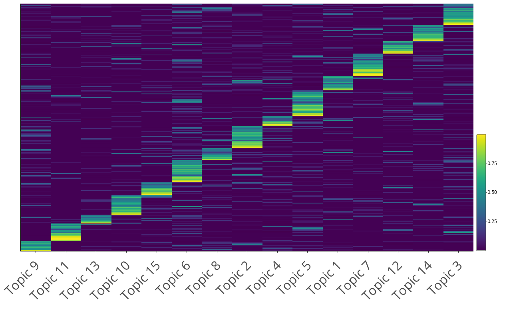

## Data collection and analysis

### Identification and processing of movement ecology papers

From now on, we refer to movement ecology as mov-eco

1. Searching for mov-eco papers:

  * We defined mov-eco papers as scientific peer-reviewed papers that studied the voluntary movement of one or more living individuals. This included humans. 
  
  * We used Web of Science (WoS) as a search engine for the papers. 

  * Very few papers mention "movement ecology" in their abstracts, so we did not use "movement ecology" as a search phrase. After much testing, we came up with the following groups of words:
  
    * Group 1 - Behavior: behavio
    * Group 2 - Movement: movement, moving, motion, spatiotemporal, kinematics, spatio-temporal
    * Group 3 - Biologging: telemetry, geolocat, biologg, accelerom, gps, geo-locat, bio-logg, reorient, vhf, argos, radar, sonar, gls, vms, animal-borne
    * Group 4 - Individuals: animal, individual, human, person, people, player, wildlife, fishermen
    
    Paper abstracts had to have words from at least 3 of the groups above to be selected. Also, unless they had words from group 3, they could not contain:
    
    * Group 5 - Missleading words: cell, DNA, enzyme, strain, neurons, atom, molecule, lymph, cortex, cortic, neurotransmi, patient prosthese, eye, particle, tectonic, counsel, cognit, market, spine, questionnaire, sendentary, insulin
    
    The search on WoS was made over a final selection of [273 journals](https://github.com/rociojoo/MovEcoReview-Repository/blob/master/Manuscript/Journal_table_4col.md); made in parallel with keyword tunning. 
    
> RJ: For now I'm giving a link to the .md journals list file
    
  * Cleaning the results in R: 
  
  The grouping critera was applied to the Topic field, which searches the Title, Abstract, and Keywords sections in WoS. We downloaded the search results from WoS, which contain information on title, keywords, abstracts and authors, among others. We downloaded all references in raw `.txt` format as it was the valid input for the refsplitr package available for R on github (https://github.com/embruna/refsplitr) (@Rrefsplitr). Refsplitr reads in multiple WoS files, parses addresses, and performs author matching. We used the `references_read` function to compile the .txt files into one data sheet. To be sure that the papers shown in our search in WoS were respecting our search criteria for the abstracts, we applied the same filters described above to the downloaded search results via R. In addition to the grouping criteria we filtered by Document Type to only allow 'Articles','Proceedings Papers', and 'Reviews'. [RJ: We should insert here a link to the R code for this part.]
  
  8007 papers were obtained from this.

> RJ: Updated.  
  
  * Quality control:
  
  From the cleaned results, we took a random sample of 100 papers (i.e. with title, abstracts and other features taken from WoS). We then read the abstracts and classified them into "mov-eco" and "not mov-eco". If the percentage of mov-eco papers (i.e. precision) was lower than 80%, the word criterion used for the search would be improved (e.g. adding more words, editing some, changing the rules for the groups). This is how we came up with the groups introduced above. We obtained 90% of precision. That means that, from the papers that we had, almost all of them were mov-eco papers.
  
 We also wanted to obtain a recall or sensitivity rate to quantify, from the universe of mov-eco papers in the literature, how many we had in our search results. To get an exact number is an impossible task because if we could get the "real" list of mov-eco papers in the literature, we would use it in the first place. Instead, we looked at the list of papers published by the journal Movement Ecology. 69% of them were in our list. An estimated sensitivity of 69% and precision of 90% implies that though we did not get the whole population of mov-eco papers in our set, from the set of papers that we have, there is a very high certainty that they are mov-eco papers. 

> RJ: We should comment more on the mov-eco papers. We should count how many don't have abstracts. And be sure we are doing this for 2009-2018. Matt, help?

  * Possible biases:
 
  We have no reason to believe that our searching criteria has introduced biases to our results. The relatively short list of words is due to the fact that other words we tried were reducing our precision, providing us many papers that were not about movement ecology. Of course, it is always possible that we forgot to try an important word. A possible bias could come from WoS: we were not able to get papers that were not in WoS, which depends on WoS agreements 
  
> MB: Also, are we sure that the 'Topic' search works as we think, and does not introduce any fuzzy search for instance? MEB: I double checked and simona and rocio smartly used exact matching. Which for the sake of WOS means all terms are quoted.

> RJ: Of course we are not sure. That's all WoS. All we could do was a filter on it. Otherwise, downloading all papers that said "movement" and then doing the filter ourselves would have been too much (the manual downloading part).

  
  * Differences with other approaches selecting and analyzing mov-eco papers:
  
    * @Holyoak2008: Their goal was to find papers about movement of organisms or gametes, so their definition of movement ecology was somewhat broader than ours. We were inspired by their procedure, and tried the terms that they showed in the paper that would be consistent with our definition of mov-eco. Like us, they used WoS to build their literature dataset. They had a two-step criterion to select the papers. First, they screened the WoS for papers that contained their keywords. Then, they narrowed down the selection by excluding non-ecological journals from their initial results. Two of their coauthors decided on a list of 496 journals. We applied a similar procedure but using a modified set of keywords because we found their criteria to be too broad for our definition, and then two coauthors (R.J. and S.P.) decided on 273 journals. Among the remaining articles, they selected a random sample of 1000 papers for quality control, rating them as relevant or not. Their overall success rate (similar to our precision) was 77%. Unlike them, we explicitly looked for papers on human movement, which they did not attempt. 
    
> MB: So the differences in terms of scope are the restriction to 'voluntary' movement for us, and the addition of gametes for them? What do you mean with explicit consideration of humans? Were they excluded in their approach?  Also, what are the differences between the two lists of journals?
> RJ: 1) Yes. 2) That we explicitly searched for humans with our fourth group of words. 3) They didn't say that, but they didn't look for them, and when reading the paper is just about animals and plants. 4) Well, they have more journals. We decided on what made sense for us, what we believed could have articles relevant for movement ecology. Including human journals. Also, the list is also dependent on what WoS showed at the time.

    * @Fraser2018: They also used the WoS. In "Topics", they search for "ecology" and either "movement", "migrat", "home range", "dispersal" or "track".     Their combination of words were too vague in our opinion, and they did not mention any quality control (e.g. precision, recall, specificity, sensitivity) statistic.
    
  * Downloading the whole manuscripts:
  
    * We used the *fulltext* package (@Rfulltext) in @R2018, using Elsevier, Springer, Scopus, Wiley, BMC and PLOS one API keys. We downloaded the articles we had access to, as xml or pdf documents. We downloaded a total of 3230 complete manuscripts, representing 60% of our list of mov-eco papers. 
    
    
> RJ: When sharing the code, we should not share the API keys. MEB: So do we have two repositories then...?
> RJ: I think we should, actually. Let's talk about it.

> RJ: Can't know anymore how many xml and pdf for sure. The 3230 sum is equal to the number of fulltext.RData files + Science papers ~13 + NOAA bulletins ~2, so 3230.
    
  * Extracting the Material and Method's (M&M) section:
  
    * For some analyses, we needed the Material and methods section of the manuscripts. We created codes for .xml and .pdf files [RJ: We should put the links here], using the *xml2* (@Rxml2) and *tm* (@Rtm) packages, respectively. They took account of the structure of the papers in either format, and aimed at finding section names related to "Methods", "Data" or "Statistical Analysis". Not all papers had an M&M section (e.g. reviews or perspective papers). We were able to extract 2865 M&M sections (53% of mov-eco papers).
    
> MB: … but 89% of those with full text. Don't you need full text to do this?
> RJ: What?
    
### Analysis 

  * Dictionaries or closed-ended questionnaires: 

There were particular aspects in movement ecology that we wanted to assess: 1) the study of different components of the movement ecology framework, 2) the use of biologging devices, 3) the use of software, 4) the use of statistical methods and 5) the species and taxonomical groups studied. Investigating these specific aspects is like applying a survey to papers (as if they were participants) and asking closed-ended questions. A closed-ended question is a question with options from which to choose a response. For all of these aspects except taxonomy, we built what we call here "dictionaries". A dictionary is a data frame related to a theme (e.g. software), where each column represents one category in that theme (e.g. R, Matlab, Python), and the values in the rows are terms that could be used in a manuscript to refer to the category (e.g. "R Software", "R Development Core"). The terms could be composed of a mix of regular expressions. One dictionary per aspect was build. TAC was in charge of the framework dictionary, SP and MEB of the devices one, MEB of the use of software, and RJ of the statistical methods one. Other coauthors could give suggestions for any dictionary. The terms in the framework dictionary would be searched in title, keywords and abstract of the manuscripts. For the rest, the information would also be looked for in the M&M section. This analysis was done in R; the code is in https://github.com/rociojoo/MovEcoReview-Repository/blob/master/R/Dictionary_Analysis.R. To assessed how well the dictionaries were identifying the categories (e.g. types of softwares used) in the papers, a quality control procedure was established. For each aspect, a random sample of papers was selected, and a coauthor who was not leading the dictionary was randomly selected to check if in those papers the categories of the dictionary were correctly identified (i.e. accuracy). For the framework, the sample was composed of 100 papers, for the other four that contained M&M sections, the number was 50. The accuracy was 91%, XX%, 88% and 84%, for the framework, devices, software and methods dictionaries, respectively. Details on each dictionary can be found in https://github.com/rociojoo/MovEcoReview-Repository/tree/master/Documentation (readme files).

> RJ: Mathieu, you were in charge of the XX% part, please fill it in. I can't find it in my records.
    
> RJ: I'll have to find somewhere to explain that "proportion of articles in a year" in every figure is over the total of papers from which we extracted valuable information.
  
For taxonomy, S.P. and M.E.B. used the ITIS (Integrated Taxonomic Information System) database (USGS Core Science Analytics and Synthesis) to detect names of any animal species (kingdom Animalia) that were mentioned in the papers. We screened abstracts, titles, and keywords for latin and common (i.e., vernacular) names of species (both singular and plural), as well as common names of higher taxonomic levels such as orders and families. We excluded ambiguous terms that are used as common names for taxa but also have a current language meaning; for example: "Here", "Scales", "Costa", "Ray", etc. Because we wanted to consider humans as a separate category, we excluded "Homo sapiens" from the search terms, but used the following non-ambiguous terms to identify papers that focus on movement ecology of humans: "player", "players", "patient", "patients", "child", "children", "teenager", "teenagers", "people", "student", "students", "fishermen", "person", "tourist", "tourists", "visitor", "visitors", "hunter", "hunters", "customer", "customers", "runner", "runners", "participant", "participants", "cycler", "cyclers", "employee", "employees", "hiker", "hikers", "athlete", "athletes", "boy", "boys", "girl", "girls", "woman", "women", "man", "men", "adolescent", "adolescents". In cases where words may be suffixes of larger words, we used regular expression notation to exact match words, e.g 'man' must match only the word 'man' and not 'human' or 'postman'. We excluded words that could have an ambiguous meaning: "passenger" may appear in papers that mention passenger pigeons; "driver" may be used to refer to a causing factor. After having identified any taxon mentioned in a paper, we summarized all taxa at the Class level. Thus, each paper was classified as focusing on one or more Classes; for example - mammals, birds, insects, etc. For the purpose of our analysis, we kept humans as a separate category and did not count them within Class Mammalia. 

> MB: "man" appears both in the list of non-ambiguous terms, and right after in the list of excluded terms. MEB: I think this was a typo, I edited it appropriately. For the record most of these words I added regular expression to exact match when appropriate or * when appropriate. 

The quality control procedure consisted in selecting a random sample of 100 abstracts and verifying that the common taxonomical group was correctly identified. The accuracy was 93%. The code for taxonomical identification can be found in https://github.com/rociojoo/MovEcoReview-Repository/blob/master/R/taxonomy_analysis_meb.R

Once we were able to identify the components of the framework, biologging devices, software, methods and organisms that each paper was focusing on, we computed descriptive statistics (e.g. barplots and time series plots). 

  * Topic modeling or open-ended questionnaire:
  
In addition to asking closed-ended questions to the papers, we aimed at obtaining the topics that the articles were studying using an unsupervised data-driven approach; it was like asking an open-ended question to papers, because we did not define the topics a priori. We fitted Latent Dirichlet Allocation (LDA) models to the data (@Blei2003). LDAs are basically three-level hierarchical Bayesian models for documents (in our case, abstracts). Here we assume that there are latent or hidden topics behind the abstracts, and that the choice of words in the abstracts are related to the topics the authors are addressing. Thus, an abstract would be composed of one or more topics, and a topic would be composed of a mixture of words. The probability of a word appearing in an abstract would depend on the topic the abstract is adressing. There are several variations of topic models (@Nunez-Mir2016). Here we use the LDA model with variational EM estimation (@Wainwright2008) implemented in the *topicmodels* package. All the details of the model specification and estimation are in @Grun2011. 

To improve the quality of our LDA model outputs, we cleaned the data by 1) removing unuseful words for identifying topics (e.g. prepositions and numbers), 2) converting all British English words to American English so they would not be seen as different words, 3) lemmatizing (i.e. extracting the lemma of a word based on its intended meaning, with the aim of grouping words under the same lemma) (@Ingason2008), 4) filtering out words that were only used once in the whole set of abstracts. R packages *tidytext* (@Silge2016), *tm* and *textstem* (@Rtextstem) were used in this stage. 

The parameter estimates of the LDA model were obtained by running 20 replicates of the models (with the VEM estimation method), and keeping the one with the highest likelihood [RJ: add link to the code]. A key argument in the fitting function is the number of latent topics. The most commonly used criterion to choose a number of topics is the perplexity score or likelihood of a test dataset (@Waal2008). Basically, this quantity measures the degree of uncertainty a language model has when predicting some new text (for this study, a new abstract of a paper). Lower values of the perplexity is good and it means the model is assigning higher probabilities. However, the perplexity score measures predictive capacities, rather than having actual humanly-interpretable latent topics (@Chang2009). In fact, using this score could result into having too many topics; see @Griffiths2004 who analyzed PNAS abstracts and obtained 300 topics. Hence, we decided to fix the number of topics to 15, as a reasonable value that would not be too large than we could not interpret them, or too small that the topics were too general. 

  From the fitted LDA model, we obtained 1) the probabilities of having a word in a document given the presence of a certain topic (denoted by $\beta$), and 2) the probabilities of a topic being referred to in each document (denoted by $\gamma$). The $\beta$s were used to interpret and label each topic, and to create wordclouds for each topic, where the area occupied by each word was proportional to its $\beta$ value (Fig.7 in the manuscript). 
  
  To check for consistency, for each topic, we selected the papers that were highly associated with the topic ($\gamma > 0.75$), and computed the number of times each unique word occurred in the abstracts related to the topic. We divided those values by the number of total words in the topic to get a relative frequency, denoted by $\delta$. We then created wordclouds for each topic, where the area occupied by each word was proportional to its $\delta$ value (Fig.S1). These wordclouds were consistent with the topic wordclouds, and gave complementary information. A heatmap of the $\gamma$ values also showed that most papers were evidently more associated to one topic and few were splitted into several topics (Fig. S1b).
  
  {width=100%}
  
  {width=100%}
  

> MB: You could have a general section for software used, and simply list those 'generic' packages here. MEB Vilma mentioned things like tidyr, in my opinion that doesnt make much sense. The analysis could be done without tidyr and stringr (i didnt use stringr maybe rocio did). We have a lot of packages used, are we going to describe how we used every package? If so this section needs to be a lot longer. PDF and XML conversion for instance, never mentioned it because I did not expect we needed to. Its sort of implicit in the code we're going to share so is any of that necessary?
> RJ: OK, I won't do it for now, but I'll keep this in mind for later.

### Sankey graphs

We used the `plot_ly` function with variable `type` set to `sankey` from the plotly package to create Sankey diagrams for the relationship between Dictionary categories. Sankey diagrams are a type of flow diagram where the width of a line segment connecting two categories is proportional to the total amount of common features between those two cateogries. To build these plots we created a matrix summing the total number of papers that contained both the first dictionary category and second dictionary category. One side effect on this method is that each plot only compares adjacent dictionaries. Meaning if we have a plot with three dictionaries we know the relationship between the 1st and 2nd dictionary and the relationship between the 2nd and 3rd, but do not know the relationship between the 1st and 3rd Dictionary. The exception to this is the separate taxonomy plots. For these plots, we filtered our data set by each taxa first and then created our matrix with the remaining papers.

## Additional results
  
### Framework

|Component            |2009-2018| 1999-2008|
|---------------------|---------| ---------|
|External factors     |   77.3% |     76.7%|
|Internal state       |   49.0% |     45.7%|
|Motion capacity      |   26.2% |     27.6%|
|Navigation capacity  |   9.0%  |     11.8%|

Table S1: Framework components. The values are the percentages of abstracts (where information on the framework was gathered) that use terms related to each component. 

{width=70%}

{width=70%}

{width=70%}

> MB: Let me suggest that you include 0 on the y-axis in every figure with proportions.
> RJ: OK, I'll do that after.

[Comments for me]: # (RJ: I should edit the labels)

{width=70%}

{width=70%}

{width=70%}

{width=70%}

{Fig.S10. Sankey plot linking taxonomical groups, devices and topics}

{Fig.S11. Time series of the number of species studied by taxonomical group}

> MB: There are better color scale for categorical variables. I sent something recently about it (either in an email or on Slack).

| general | Movement  | spatial | time-series | social | spatiotemporal |
|---------|-----------|---------|-------------|--------|----------------|
| 71.3%   |  31.6%    |  19.2%  |   14.9%     | 3.5%   |    0.4%        |

Table S2. Percentage of papers using each type of statistical method. 

{Fig.S12. Word cloud for Materials and methods sections. The area occupied by each word is proportional to the proportion of papers that mention it. Words in this cloud have a mininum relative frequency of 0.2.}

> MB: Is this correct? Is it really the area that is proportional? I thought it was the font size. Also this cloud is hard to read, as nothing really sticks out. Maybe use a transformation (exponential-like) to get bigger contrasts between low and high scores?

> RJ: Please read the manuscript and then let me know if you still think fell strong about your comments. Maybe we won't need these graphics in the end...

|Topic | Gamma  |
|------|--------|
|    6 | 820.51 |
|    5 | 729.78 |
|    3 | 679.04 |
|    2 | 663.31 |
|   10 | 572.60 |
|    7 | 563.75 |
|   14 | 485.59 |
|   12 | 482.64 |
|   11 | 474.03 |
|    1 | 467.50 |
|   15 | 466.85 |
|    8 | 456.26 |
|    9 | 453.32 |
|    4 | 402.56 |
|   13 | 280.27 |

Table S3. Sum of gamma values for each topic. 

{Fig.S13. Proportion of articles in each year studying each taxonomical group}

{Fig.S14. Number of articles addressing each research subject}

> MB: I'm surprised this is not in better agreement with the table above (sum of gamma values). This should give more or less the same thing, right?

> RJ: No. Gamma is importance overall as a topic within abstracts and this is about being actually the research topic of an abstract (with gamma>0.75)

{Fig.S15. Proportion of articles in each year addressing each research subject}
